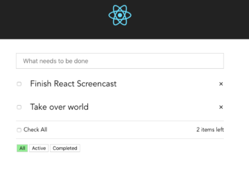

# AndreMadarang-ReactTodoAppWithMobX-20180603

> 🧩 Andre Madarang - React Todo App (Jun 3, 2018)

Link: https://www.youtube.com/playlist?list=PLEhEHUEU3x5qz5OYDXamBmYnLvwboYTdH

**Description**
> In this series, we'll build a Todo App in React. Although a todo app isn't very exciting, it gives a solid foundation on the basics of a framework and how to perform CRUD actions. We go over the basics, look at several ways to communicate between components, take a look at state management and eventually hook it up to a Laravel API backend for persistence.

---


### Table of Contents


- [AndreMadarang-ReactTodoAppWithMobX-20180603](#andremadarang-reacttodoappwithmobx-20180603)
    - [Table of Contents](#table-of-contents)
- [1 - Basics (Vue Dev POV) - Part 1](#1---basics-vue-dev-pov---part-1)
  - [1.1 - Overview of the Application](#11---overview-of-the-application)
  - [1.2 - Project Setup](#12---project-setup)
  - [1.3 - Get Codes from Vue TodoApp](#13---get-codes-from-vue-todoapp)
  - [1.4 - Adding State](#14---adding-state)
  - [1.5 - V-for ⇒ Map Function](#15---v-for--map-function)
  - [1.6 - @keyup.enter ⇒ onKeyUp](#16---keyupenter--onkeyup)
  - [1.7 - v-model in React](#17---v-model-in-react)
  - [1.8 - Adding todos in the display of todos (setState method)](#18---adding-todos-in-the-display-of-todos-setstate-method)
  - [1.9 - Delete Todo](#19---delete-todo)
  - [1.10 - onChange](#110---onchange)
  - [1.11 - Editing a Todo](#111---editing-a-todo)
  - [1.12 - Done Editing Todo](#112---done-editing-todo)
- [2 - Basics (Vue Dev POV) - Part 2](#2---basics-vue-dev-pov---part-2)
  - [2.1 - Remaining Items Counter @e244](#21---remaining-items-counter-e244)
  - [2.2 Clear Completed Items](#22-clear-completed-items)
    - [Count Completed Items and conditional rendering](#count-completed-items-and-conditional-rendering)
  - [clearCompletedTodos Method](#clearcompletedtodos-method)
  - [2.3 Filter Todos](#23-filter-todos)
    - [Filter buttons](#filter-buttons)
    - [Filter Function @e1130](#filter-function-e1130)
  - [2.4 Select All Todos](#24-select-all-todos)
  - [2.5 Transitions](#25-transitions)
- [3 - Extracting Components](#3---extracting-components)
    - [3.1 - TodosRemaining](#31---todosremaining)
    - [3.2 - Validating Props](#32---validating-props)
  - [3.3 - TodoItem.js](#33---todoitemjs)
    - [Validate the props as well](#validate-the-props-as-well)
  - [3.4 - TodosCheckAll.js](#34---todoscheckalljs)
  - [3.5 TodosFiltered.js](#35-todosfilteredjs)
  - [3.6 - TodosClearCompleted.js](#36---todosclearcompletedjs)
- [4 - MobX State Management](#4---mobx-state-management)
  - [4.1 - State Management Overview](#41---state-management-overview)
  - [4.2 - MobX Setup](#42---mobx-setup)
  - [4.3 - store/TodoStore.js @e940 and @observable](#43---storetodostorejs-e940-and-observable)
  - [4.4 moving all functions to the TodoStore @action](#44-moving-all-functions-to-the-todostore-action)
    - [Moving addTodo() from app.js to the TodoStore](#moving-addtodo-from-appjs-to-the-todostore)
    - [move the other functions](#move-the-other-functions)
    - [TodoItem.js](#todoitemjs)
  - [4.5 - @Computed](#45---computed)
- [5 - API Integration](#5---api-integration)

---
# 1 - Basics (Vue Dev POV) - Part 1

## 1.1 - Overview of the Application

**Goal:** To remake this  app using react and mobx:

[Vue.js Todo App](https://www.youtube.com/playlist?list=PLEhEHUEU3x5q-xB1On4CsLPts0-rZ9oos)

[drehimself/todo-vue](https://github.com/drehimself/todo-vue/tree/01-basics)

---

## 1.2 - Project Setup

```jsx
npx create-react-app andremadarang-reacttodoappwithmobx-20180603
```

## 1.3 - Get Codes from Vue TodoApp

App.css

```css
* {
  box-sizing: border-box;
}

.App {
  /* text-align: center; */
  font-family: "Avenir", Helvetica, Arial, sans-serif;
  -webkit-font-smoothing: antialiased;
  -moz-osx-font-smoothing: grayscale;
  font-size: 24px;
}

.App-logo {
  animation: App-logo-spin infinite 20s linear;
  height: 80px;
}

.App-header {
  background-color: #222;
  text-align: center;
  /* height: 150px; */
  padding: 20px;
  color: white;
}

.App-title {
  font-size: 1.5em;
}

.Todo-container {
  max-width: 600px;
  margin: 40px auto;
}

/* @keyframes App-logo-spin {
  from { transform: rotate(0deg); }
  to { transform: rotate(360deg); }
} */

.todo-input {
  width: 100%;
  padding: 10px 18px;
  font-size: 18px;
  margin-bottom: 16px;
}

.todo-input:focus {
  outline: 0;
}

.todo-item {
  margin-bottom: 12px;
  display: flex;
  align-items: center;
  justify-content: space-between;
  animation-duration: 0.3s;
}

.remove-item {
  cursor: pointer;
  margin-left: 14px;
}

.remove-item:hover {
  color: black;
}

.todo-item-left {
  display: flex;
  align-items: center;
}

.todo-item-label {
  padding: 10px;
  border: 1px solid white;
  margin-left: 12px;
}

.todo-item-edit {
  font-size: 24px;
  color: #2c3e50;
  margin-left: 12px;
  width: 100%;
  padding: 10px;
  border: 1px solid #ccc;
  font-family: "Avenir", Helvetica, Arial, sans-serif;
}

.todo-item-edit:focus {
  outline: none;
}

.completed {
  text-decoration: line-through;
  color: grey;
}

.extra-container {
  display: flex;
  align-items: center;
  justify-content: space-between;
  font-size: 16px;
  border-top: 1px solid lightgrey;
  padding-top: 14px;
  margin-bottom: 14px;
}

button {
  font-size: 14px;
  background-color: white;
  appearance: none;
  margin: 2px;
}

button:hover {
  background: lightgreen;
}

button:focus {
  outline: none;
}

.active {
  background: lightgreen;
}

.fade-enter {
  opacity: 0;
}

.fade-enter-active {
  opacity: 1;
  transition: opacity 300ms ease-in;
}

.fade-leave {
  opacity: 1;
}

.fade-leave-active {
  opacity: 0;
  transition: opacity 300ms ease-out;
}
```

App.js

```jsx
import React, { Component } from 'react';
import logo from './logo.svg';
import './App.css';

class App extends Component {
  // START: TEMPLATE
  render() {
    return (
      <div className="App">
        {/* START: HEADER */}
        <header className="App-header">
          
        </header>
        {/* END: HEADER */}

        {/* START: TODO CONTAINER */}
        <div className="Todo-container">
          <input type="text" className="todo-input" placeholder="What needs to be done" />

          {/* START: Sample Todo */}
          <div className="todo-item">
            <div className="todo-item-left">
              <input type="checkbox" />
              <div className="todo-item-label">Todo Item 1</div>
            </div>
            <div className="remove-item">
              &times;
            </div>
          </div>
          {/* End: Sample Todo */}

          {/* START: Select All and Item Remaining Counter */}
          <div class="extra-container">
            <div><label><input type="checkbox" /> Check All</label></div>
            <div>remaining items left</div>
          </div>
          {/* END: Select All and Item Remaining Counter */}

          {/* START: Extra Buttons */}
          <div class="extra-container">
            <div>
              <button >All</button>
              <button>Active</button>
              <button >Completed</button>
            </div>

            <div>
              <transition name="fade">
                <button >Clear Completed</button>
              </transition>
            </div>
          </div>
          {/* END: Extra Buttons */}
        </div>
        {/* END: TODO CONTAINER */}

      </div >
    );
  }
  // END: TEMPLATE
}

export default App;
```

## 1.4 - Adding State

since this is done in vue way, the guy places the states below the render template of the class component like this:

App.js

```jsx
import React, { Component } from 'react';
import logo from './logo.svg';
import './App.css';

class App extends Component {
  // START: TEMPLATE
  render() {
    return (
      <div className="App">
        {/* START: HEADER */}
        <header className="App-header">
          
        </header>
        {/* END: HEADER */}

        {/* START: TODO CONTAINER */}
        <div className="Todo-container">
          <input type="text" className="todo-input" placeholder="What needs to be done" />

          {/* START: Sample Todo */}
          <div className="todo-item">
            <div className="todo-item-left">
              <input type="checkbox" />
              <div className="todo-item-label">Todo Item 1</div>
            </div>
            <div className="remove-item">
              &times;
            </div>
          </div>
          {/* End: Sample Todo */}

          {/* START: Select All and Item Remaining Counter */}
          <div class="extra-container">
            <div><label><input type="checkbox" /> Check All</label></div>
            <div>remaining items left</div>
          </div>
          {/* END: Select All and Item Remaining Counter */}

          {/* START: Extra Buttons */}
          <div class="extra-container">
            <div>
              <button >All</button>
              <button>Active</button>
              <button >Completed</button>
            </div>

            <div>
              <transition name="fade">
                <button >Clear Completed</button>
              </transition>
            </div>
          </div>
          {/* END: Extra Buttons */}
        </div>
        {/* END: TODO CONTAINER */}

      </div >
    );
  }
  // END: TEMPLATE

  // START: STATES
  state = {
    todos: [
      {
        'id': 1,
        'title': 'Title1',
        'completed': false,
        'editing': false,
      },
      {
        'id': 2,
        'title': 'Title2',
        'completed': false,
        'editing': false,
      },
    ]
  }
  // END: STATES
}

export default App;
```

## 1.5 - V-for ⇒ Map Function

App.js

```jsx
{/* Start: Display Todos */}
          {this.state.todos.map((todo, index) => {
            return (
              <div className="todo-item" key={todo.id }>
                <div className="todo-item-left">
                  <input type="checkbox" />
                  <div className="todo-item-label">{todo.title}</div>
                </div>
                <div className="remove-item">
                  &times;
            </div>
              </div>
            )
          })}
 {/* End: Display Todos */}
```

Overview of App.js

```jsx
import React, { Component } from 'react';
import logo from './logo.svg';
import './App.css';

class App extends Component {
  // START: TEMPLATE
  render() {
    return (
      <div className="App">
        {/* START: HEADER */}
        <header className="App-header">
          
        </header>
        {/* END: HEADER */}

        {/* START: TODO CONTAINER */}
        <div className="Todo-container">
          <input type="text" className="todo-input" placeholder="What needs to be done" />

          {/* Start: Display Todos */}
          {this.state.todos.map((todo, index) => {
            return (
              <div className="todo-item" key={todo.id }>
                <div className="todo-item-left">
                  <input type="checkbox" />
                  <div className="todo-item-label">{todo.title}</div>
                </div>
                <div className="remove-item">
                  &times;
            </div>
              </div>
            )
          })}
          {/* End: Display Todos */}

          {/* START: Select All and Item Remaining Counter */}
          <div class="extra-container">
            <div><label><input type="checkbox" /> Check All</label></div>
            <div>remaining items left</div>
          </div>
          {/* END: Select All and Item Remaining Counter */}

          {/* START: Extra Buttons */}
          <div class="extra-container">
            <div>
              <button >All</button>
              <button>Active</button>
              <button >Completed</button>
            </div>

            <div>
              <transition name="fade">
                <button >Clear Completed</button>
              </transition>
            </div>
          </div>
          {/* END: Extra Buttons */}
        </div>
        {/* END: TODO CONTAINER */}

      </div >
    );
  }
  // END: TEMPLATE

  // START: STATES
  state = {
    todos: [
      {
        'id': 1,
        'title': 'Title1',
        'completed': false,
        'editing': false,
      },
      {
        'id': 2,
        'title': 'Title2',
        'completed': false,
        'editing': false,
      },
    ]
  }
  // END: STATES
}

export default App;
```

## 1.6 - @keyup.enter ⇒ onKeyUp

App.js: onKeyup

```jsx
<input type="text" className="todo-input" placeholder="What needs to be done" onKeyUp={this.addTodo} />
```

then adding method under states

```jsx
// START: METHODS
  addTodo(event) {
     console.log('working')
  }
  // END: METHODS
```

if you try checking ur browser console and inputting stuff in the input, it works

```jsx
// START: METHODS
  addTodo(event) {
    if (event.key === 'Enter') {
      console.log('working')
    }
  }
  // END: METHODS
```

now what we did here was if the user presses enter after inputting value in the input, instead for every key presses, will print to console.

```jsx
import React, { Component } from 'react';
import logo from './logo.svg';
import './App.css';

class App extends Component {
  // START: TEMPLATE
  render() {
    return (
      <div className="App">
        {/* START: HEADER */}
        <header className="App-header">
          
        </header>
        {/* END: HEADER */}

        {/* START: TODO CONTAINER */}
        <div className="Todo-container">
          <input type="text" className="todo-input" placeholder="What needs to be done" onKeyUp={this.addTodo} />

          {/* Start: Display Todos */}
          {this.state.todos.map((todo, index) => {
            return (
              <div className="todo-item" key={todo.id}>
                <div className="todo-item-left">
                  <input type="checkbox" />
                  <div className="todo-item-label">{todo.title}</div>
                </div>
                <div className="remove-item">
                  &times;
            </div>
              </div>
            )
          })}
          {/* End: Display Todos */}

          {/* START: Select All and Item Remaining Counter */}
          <div class="extra-container">
            <div><label><input type="checkbox" /> Check All</label></div>
            <div>remaining items left</div>
          </div>
          {/* END: Select All and Item Remaining Counter */}

          {/* START: Extra Buttons */}
          <div class="extra-container">
            <div>
              <button >All</button>
              <button>Active</button>
              <button >Completed</button>
            </div>

            <div>
              <transition name="fade">
                <button >Clear Completed</button>
              </transition>
            </div>
          </div>
          {/* END: Extra Buttons */}
        </div>
        {/* END: TODO CONTAINER */}

      </div >
    );
  }
  // END: TEMPLATE

  // START: STATES
  state = {
    todos: [
      {
        'id': 1,
        'title': 'Title1',
        'completed': false,
        'editing': false,
      },
      {
        'id': 2,
        'title': 'Title2',
        'completed': false,
        'editing': false,
      },
    ]
  }
  // END: STATES

  // START: METHODS
  addTodo(event) {
    if (event.key === 'Enter') {
      console.log('working')
    }
  }
  // END: METHODS

}

export default App;
```

## 1.7 - v-model in React

under state object in App.js

```jsx
todoInput = React.createRef();
```

afterwards, you add a ref attribute to this.todoInput in the input tag

```jsx
<input type="text" className="todo-input" placeholder="What needs to be done" onKeyUp={this.addTodo} ref={this.todoInput} />
```

then in your addTodo method in the methods section, we should change our custom method into an arrow function instead of just a normal function in order to use "this".

```jsx
// START: METHODS
  addTodo = (event) => {
    if (event.key === 'Enter') {
      const todoInput = (this.todoInput.current.value);
      console.log(todoInput);
    }
  }
  // END: METHODS
```

try it again and it works now with whatever you had in the input 

## 1.8 - Adding todos in the display of todos (setState method)

add new field in state object then in addTodo method implement setState method like this:

App.js

```jsx
// START: STATES
  state = {
    todos: [
      {
        'id': 1,
        'title': 'Title1',
        'completed': false,
        'editing': false,
      },
      {
        'id': 2,
        'title': 'Title2',
        'completed': false,
        'editing': false,
      },
    ],
    todoId: 3
  }
  todoInput = React.createRef();
  // END: STATES

  // START: METHODS
  addTodo = (event) => {
    if (event.key === 'Enter') {
      const todoInput = this.todoInput.current.value;

      //Start: if input value is empty, do not add
      if (todoInput.trim().length === 0) {
        return;
      }
      //End--

      // Start: Add new todo to todos for display
      this.setState((prevState, props) => {
        console.log(todoInput);
        let newTodoId = prevState.todoId++;

        let newTodos = [
          ...prevState.todos,
          {
            id: newTodoId,
            title: todoInput,
            completed: false,
          }
        ]

        return {
          todos: newTodos
        }
      })
      // End: --

      this.todoInput.current.value = ""

    }
  }
  // END: METHODS
```

## 1.9 - Delete Todo

add onClick: deleteTodo Method at App.js

```jsx
{/* Start: Display Todos */}
          {this.state.todos.map((todo, index) => {
            return (
              <div className="todo-item" key={todo.id}>
                <div className="todo-item-left">
                  <input type="checkbox" />
                  <div className="todo-item-label">{todo.title}</div>
                </div>
                <div className="remove-item" onClick={() => this.deleteTodo(index)}>
                  &times;
                </div>
              </div>
            )
          })}
          {/* End: Display Todos */}
```

then define deleteMethod in methods section below

```jsx
/**
   * START: 
   * @name: deleteTodo()
   * @description: deletes todo
   * @param index
   */
  deleteTodo = index => {
    // Start: Deletes todo 
    this.setState((prevState, props) => {
      let todos = prevState.todos;

      //have the index, and just remove that 1.
      todos.splice(index, 1);

      return {
        todos: todos
      }
    })
    // End: Deletes todo 
  }
  // END: deleteTodo()
```

Overview of App.js

```jsx
import React, { Component } from 'react';
import logo from './logo.svg';
import './App.css';

class App extends Component {
  // START: TEMPLATE
  render() {
    return (
      <div className="App">
        {/* START: HEADER */}
        <header className="App-header">
          
        </header>
        {/* END: HEADER */}

        {/* START: TODO CONTAINER */}
        <div className="Todo-container">
          <input type="text" className="todo-input" placeholder="What needs to be done" onKeyUp={this.addTodo} ref={this.todoInput} />

          {/* Start: Display Todos */}
          {this.state.todos.map((todo, index) => {
            return (
              <div className="todo-item" key={todo.id}>
                <div className="todo-item-left">
                  <input type="checkbox" />
                  <div className="todo-item-label">{todo.title}</div>
                </div>
                <div className="remove-item" onClick={() => this.deleteTodo(index)}>
                  &times;
                </div>
              </div>
            )
          })}
          {/* End: Display Todos */}

          {/* START: Select All and Item Remaining Counter */}
          <div class="extra-container">
            <div><label><input type="checkbox" /> Check All</label></div>
            <div>remaining items left</div>
          </div>
          {/* END: Select All and Item Remaining Counter */}

          {/* START: Extra Buttons */}
          <div class="extra-container">
            <div>
              <button >All</button>
              <button>Active</button>
              <button >Completed</button>
            </div>

            <div>
              <transition name="fade">
                <button >Clear Completed</button>
              </transition>
            </div>
          </div>
          {/* END: Extra Buttons */}
        </div>
        {/* END: TODO CONTAINER */}

      </div >
    );
  }
  // END: TEMPLATE

  // START: STATES
  state = {
    todos: [
      {
        'id': 1,
        'title': 'Title1',
        'completed': false,
        'editing': false,
      },
      {
        'id': 2,
        'title': 'Title2',
        'completed': false,
        'editing': false,
      },
    ],
    todoId: 3
  }
  todoInput = React.createRef();
  // END: STATES

  // START: METHODS
  /**
   * START: 
   * @name: addTodo()
   * @description: adds new todo
   * @param event
   */
  addTodo = (event) => {
    if (event.key === 'Enter') {
      const todoInput = this.todoInput.current.value;

      //Start: if input value is empty, do not add
      if (todoInput.trim().length === 0) {
        return;
      }
      //End--

      // Start: Add new todo to todos for display
      this.setState((prevState, props) => {
        console.log(todoInput);
        let newTodoId = prevState.todoId++;

        let newTodos = [
          ...prevState.todos,
          {
            id: newTodoId,
            title: todoInput,
            completed: false,
          }
        ]
        return { todos: newTodos }
      })
      // End: Add new todo to todos for display
      this.todoInput.current.value = ""
    }
  }
  // END: addTodo()

  /**
   * START: 
   * @name: deleteTodo()
   * @description: deletes todo
   * @param index
   */
  deleteTodo = index => {
    // Start: Deletes todo 
    this.setState((prevState, props) => {
      let todos = prevState.todos;

      //have the index, and just remove that 1.
      todos.splice(index, 1);

      return {
        todos: todos
      }
    })
    // End: Deletes todo 
  }
  // END: deleteTodo()

  // END: METHODS

}

export default App;
```

## 1.10 - onChange

added checkTodo method, onClick on checkbox, then conditional classes at div tag displaying todo title below the input.

```jsx
import React, { Component } from 'react';
import logo from './logo.svg';
import './App.css';

class App extends Component {
  // START: TEMPLATE
  render() {
    return (
      <div className="App">
        {/* START: HEADER */}
        <header className="App-header">
          
        </header>
        {/* END: HEADER */}

        {/* START: TODO CONTAINER */}
        <div className="Todo-container">
          <input type="text" className="todo-input" placeholder="What needs to be done" onKeyUp={this.addTodo} ref={this.todoInput} />

          {/* Start: Display Todos */}
          {this.state.todos.map((todo, index) => {
            return (
              <div className="todo-item" key={todo.id}>
                <div className="todo-item-left">
                  <input type="checkbox" onChange={(event) => this.checkTodo(todo, index, event)} />
                  <div className={'todo-item-label' + (todo.completed ? ' completed' : '')}>{todo.title}  </div>
                </div>
                <div className="remove-item" onClick={() => this.deleteTodo(index)}>
                  &times;
                </div>
              </div>
            )
          })}
          {/* End: Display Todos */}

          {/* START: Select All and Item Remaining Counter */}
          <div className="extra-container">
            <div><label><input type="checkbox" /> Check All</label></div>
            <div>remaining items left</div>
          </div>
          {/* END: Select All and Item Remaining Counter */}

          {/* START: Extra Buttons */}
          <div className="extra-container">
            <div>
              <button >All</button>
              <button>Active</button>
              <button >Completed</button>
            </div>

            <div>
              {/* <transition name="fade"> */}
              <button >Clear Completed</button>
              {/* </transition> */}
            </div>
          </div>
          {/* END: Extra Buttons */}
        </div>
        {/* END: TODO CONTAINER */}

      </div >
    );
  }
  // END: TEMPLATE

  // START: STATES
  state = {
    todos: [
      {
        'id': 0,
        'title': 'Title1',
        'completed': true,
        'editing': false,
      },
      {
        'id': 1,
        'title': 'Title2',
        'completed': false,
        'editing': false,
      },
    ],
    todoId: 3
  }
  todoInput = React.createRef();
  // END: STATES

  // START: METHODS
  /**
   * START: 
   * @name: addTodo()
   * @description: adds new todo
   * @param event
   */
  addTodo = (event) => {
    if (event.key === 'Enter') {
      const todoInput = this.todoInput.current.value;

      //Start: if input value is empty, do not add
      if (todoInput.trim().length === 0) {
        return;
      }
      //End--

      // Start: Add new todo to todos for display
      this.setState((prevState, props) => {
        let newTodoId = prevState.todoId++;

        let newTodos = [
          ...prevState.todos,
          {
            id: newTodoId,
            title: todoInput,
            completed: false,
          }
        ]
        return { todos: newTodos }
      })
      // End: Add new todo to todos for display
      this.todoInput.current.value = ""
    }
  }
  // END: addTodo()

  /**
   * START: 
   * @name: deleteTodo()
   * @description: deletes todo
   * @param index
   */
  deleteTodo = index => {
    // Start: Deletes todo 
    this.setState((prevState, props) => {
      let todos = prevState.todos;

      //have the index, and just remove that 1.
      todos.splice(index, 1);

      return {
        todos: todos
      }
    })
    // End: Deletes todo 
  }
  // END: deleteTodo()

  // /**
  //  * @name checkTodo()
  //  * @description checks unchecks a todo
  //  * @param todo, index
  //  */
  checkTodo = (todo, index, event) => {
    todo.completed = !todo.completed;
    this.setState((prevState, props) => {
      let todos = prevState.todos;
      todos.splice(index, 1, todo);
      return { todos };
    });
  }
  // // END: checkTodo()

  // END: METHODS

}

export default App;
```

make it more like vue's conditional classes? lets use this dependency

[JedWatson/classnames](https://github.com/JedWatson/classnames)

```jsx
yarn add classnames
```

```jsx
import * as classnames from 'classnames';

<div className={classnames({ 'todo-item-label': true, 'completed': todo.completed })} onDoubleClick={(event) => this.editTodo(todo, index, event)}>
	{todo.title}
</div>
```

## 1.11 - Editing a Todo

Method section:

```jsx
/**
 * @name editTodo()
 * @description edits a todo
 * @param todo, index
 */
  editTodo = (todo, index, event) => {
    todo.editing = true;

    this.setState((prevState, props) => {
      let todos = prevState.todos;
      todos.splice(index, 1, todo);

      return { todos };
    });
  }
// END: editTodo()
```

Template Section:

```jsx
{todo.editing ? (
	<input
		type="text"
		className="todo-item-edit"
		onDoubleClick={(event) => this.doneEditTodo(todo, index, event)}
		onKeyUp={(event) => {
			if (event.key === "Enter") {
				this.doneEditTodo(todo, index, event)
			} else if (event.key === "Escape") {
				this.cancelEditTodo(todo, index, event)
			}
		}}
		defaultValue={todo.title}
		autoFocus
	/>
 ) : (
	<div
		className={classnames({ 'todo-item-label': true, 'completed': todo.completed })}
		onDoubleClick={(event) => this.editTodo(todo, index, event)}
	>
		{todo.title}
	</div>
)}
```

- onDoubleClick - when double clicked on
- autoFocus - auto focus the user to the input
- defaultValue - default value for the input
- onBlur - when loses focus

## 1.12 - Done Editing Todo

After pressing enter on input, it should save and update state, else if pressing escape, then cancel all edits.

Method Section:

```jsx
/**
* @name doneEditTodo()
* @description updates todo after pressing "Enter"
* @param todo, index, event
*/
  doneEditTodo = (todo, index, event) => {
    event.persist();
    todo.editing = false;
    todo.title = event.target.value;

    this.setState((prevState, props) => {
      let todos = prevState.todos;
      todos.splice(index, 1, todo);
      return { todos };
    });

  }
  // END: doneEditTodo()

  /**
* @name cancelEditTodo()
* @description cancel updating todo after pressing "Escape"
* @param todo, index, event
*/
  cancelEditTodo = (todo, index, event) => {
    this.setState((prevState, props) => {
      let todos = prevState.todos;
      todo.editing = false;
      todos.splice(index, 1, todo);
      return { todos };
    });
  }
  // END: cancelEditTodo()
```

# 2 - Basics (Vue Dev POV) - Part 2

## 2.1 - Remaining Items Counter @e244

In vue, remaining was a computed property. since in react theres no computed property, we just implement a method.

App.js create new Computed section and add this computed method

```jsx
// START: COMPUTED
  /**
* @name remainingTodosCount()
* @description counts remaining items
* @param 
*/
  remainingTodosCount = () => {
    return this.state.todos.filter(todo => !todo.completed).length
  }
  // END: remaining()

  // END: COMPUTED
```

then at template

```jsx
{/* START: Select All and Item Remaining Counter */}
<div className="extra-container">
	<div><label><input type="checkbox" /> Check All</label></div>
	<div>{this.remainingTodosCount()} items left</div>
</div>
{/* END: Select All and Item Remaining Counter */}
```

then it works like a computed property

## 2.2 Clear Completed Items

### Count Completed Items and conditional rendering

Computed: 

```jsx
/**
* @name completedTodosCount()
* @description counts completed items
* @param 
*/
  completedTodosCount = () => {
    return this.state.todos.filter(todo => todo.completed).length
  }
  // END: completedTodosCount()
```

## clearCompletedTodos Method

Methods:

```jsx
/**
* @name clearCompletedTodos()
* @description clears completed todos
* @param 
*/
  clearCompletedTodos = () => {
    this.setState((prevState, props) => {
      return { todos: prevState.todos.filter((todo) => !todo.completed) }
    }
    );

  }
  // END: clearCompletedTodos()
```

Template:

```jsx
{/* Start: Clear Completed Button */}
{this.completedTodosCount() > 0 &&
	<div>
		<button onClick={() => this.clearCompletedTodos()}>Clear Completed</button>
	</div>
}
{/* End: Clear Completed Button */}
```

## 2.3 Filter Todos

### Filter buttons

Computed:

```jsx
/**
* @name updateFilter()
* @description counts completed items
* @param 
*/
  updateFilter = filter => {
    this.setState({ filter: filter })
  }
```

Template

```jsx
{/* Start: Filter Buttons */}
<div>
	<button className={classnames({ 'active': this.state.filter === 'all' })} onClick={() => this.updateFilter('all')}>All</button>
	<button className={classnames({ 'active': this.state.filter === 'active' })} onClick={() => this.updateFilter('active')}>Active</button>
	<button className={classnames({ 'active': this.state.filter === 'completed' })} onClick={() => this.updateFilter('completed')}>Completed</button>
</div>
{/* End: Filter Buttons */}
```

### Filter Function @e1130

Computed:

```jsx
/**
* @name filteredTodos()
* @description filtered todo data
* @param 
*/
  filteredTodos = () => {
    if (this.state.filter === 'all') {
      return this.state.todos;
    } else if (this.state.filter === 'active') {
      return this.state.todos.filter(todo => !todo.completed);
    } else if (this.state.filter === 'completed') {
      return this.state.todos.filter(todo => todo.completed);
    }
    return this.state.todos;
  }
  // END: filteredTodos()
```

Template:

replace this.state.todos into this.filteredTodos()

```jsx
{/* Start: Display Todos */}
          {this.filteredTodos().map((todo, index) => {
            return (
              <div className="todo-item" key={todo.id}>
                <div className="todo-item-left">
                  <input type="checkbox" onChange={(event) => this.checkTodo(todo, index, event)} />

                  {todo.editing ? (
                    <input
                      type="text"
                      className="todo-item-edit"
                      onDoubleClick={(event) => this.doneEditTodo(todo, index, event)}
                      onKeyUp={(event) => {
                        if (event.key === "Enter") {
                          this.doneEditTodo(todo, index, event)
                        } else if (event.key === "Escape") {
                          this.cancelEditTodo(todo, index, event)
                        }
                      }}
                      defaultValue={todo.title}
                      autoFocus
                    />
                  ) : (
                    <div
                      className={classnames({ 'todo-item-label': true, 'completed': todo.completed })}
                      onDoubleClick={(event) => this.editTodo(todo, index, event)}
                    >
                      {todo.title}
                    </div>
                  )}
                </div>
                <div className="remove-item" onClick={() => this.deleteTodo(index)}>
                  &times;
                </div>
              </div>
            )
          })}
{/* End: Display Todos */}
```

## 2.4 Select All Todos

Methods:

```jsx
/**
* @name checkAllTodos()
* @description Select all Todos
* @param todo, index, event
*/
  checkAllTodos = (event) => {
    event.persist();

    this.setState((prevState, props) => {
      let todos = prevState.todos;
      todos.forEach(todo => todo.completed = event.target.checked)
      return { todos };
    });

  }
  // END: checkAllTodos()
```

Template:

```jsx
{/* START: Select All and Item Remaining Counter */}
          <div className="extra-container">
            <div><label><input type="checkbox" onChange={(event)=>this.checkAllTodos(event)} /> Check All</label></div>
            <div>{this.remainingTodosCount()} items left</div>
          </div>
          {/* END: Select All and Item Remaining Counter */}
```

now it selects and unselects all todos. however if we try unchecking one todo, we want to untick the select all. with that lets reuse the remaining count and bind it to the checked attribute of the select all checkbox.

Template:

```jsx
{/* START: Select All and Item Remaining Counter */}
          <div className="extra-container">
            <div><label><input type="checkbox" checked={this.remainingTodosCount() === 0} onChange={(event) => this.checkAllTodos(event)} /> Check All</label></div>
            <div>{this.remainingTodosCount()} items left</div>
          </div>
          {/* END: Select All and Item Remaining Counter */}
```

## 2.5 Transitions

terminal

```bash
yarn add react-addons-css-transition-group 
```

App.js

```jsx
import ReactCSSTransitionGroup from 'react-addons-css-transition-group'
```

well you already have the css. anyways just wrap the component with this around the todo, and the completed button. then done

```jsx
<ReactCSSTransitionGroup
            transitionName="fade"
            transitionEnterTimeout={300}
            transitionLeaveTimeout={300}
          >

</ReactCSSTransitionGroup>
```

# 3 - Extracting Components

the frontend is finished, now we separate it into smaller components cause its all in one big ass App.js file.

the goi placed the App.js inside the components folder 😟 Dont do it. well do it our own way.

### 3.1 - TodosRemaining

create new components/TodosRemaining.js then rcc

```jsx
import React, { Component } from 'react'

export default class TodosRemaining extends Component {
  render() {
    return (
      <div>
        {this.props.remaining} items left
      </div>
    )
  }
}
```

App.js - import then add the component. then pass the according prop

```jsx
<TodosRemaining remaining={this.remainingTodosCount()} />
```

however it prolly be better to just use rsc (react stateless component) instead of just using class components. use rafce, theres no rsc anymore 🙁

TodosRemaining.js

```jsx
import React from 'react'

const TodosRemaining = ({ remaining }) => {
  return (
    <div>
      {remaining} items left
    </div>
  )
}

export default TodosRemaining
```

### 3.2 - Validating Props

```bash
yarn add prop-types
```

```jsx
import PropTypes from 'prop-types'
```

i mean instead of installing another lib, if you have typescript you can use those goodie types and interfaces but lets follow the goi.

TodosRemaining.js

```jsx
import React from 'react'
import PropTypes from 'prop-types'

const TodosRemaining = ({ remaining }) => {
  return (
    <div>
      {remaining} items left
    </div>
  )
}

TodosRemaining.propTypes = {
  remaining: PropTypes.number.isRequired
}

export default TodosRemaining
```

## 3.3 - TodoItem.js

same lng, just pass everything as props and destructure em.

TodoItem.js

```jsx
import React from 'react'
import PropTypes from 'prop-types'
import * as classnames from 'classnames';

const TodoItem = ({
  todo,
  index,
  checkTodo,
  doneEditTodo,
  cancelEditTodo,
  deleteTodo,
  editTodo
}) => {
  return (

    <div className="todo-item">
      <div className="todo-item-left">
        <input type="checkbox" onChange={(event) => checkTodo(todo, index, event)} checked={todo.completed} />

        {todo.editing ? (
          <input
            type="text"
            className="todo-item-edit"
            onDoubleClick={(event) => doneEditTodo(todo, index, event)}
            onKeyUp={(event) => {
              if (event.key === "Enter") {
                doneEditTodo(todo, index, event)
              } else if (event.key === "Escape") {
                cancelEditTodo(todo, index, event)
              }
            }}
            defaultValue={todo.title}
            autoFocus
          />
        ) : (
          <div
            className={classnames({ 'todo-item-label': true, 'completed': todo.completed })}
            onDoubleClick={(event) => editTodo(todo, index, event)}
          >
            {todo.title}
          </div>
        )}
      </div>
      <div className="remove-item" onClick={() => deleteTodo(index)}>
        &times;
                </div>
    </div>

  )
}

export default TodoItem
```

App.js

```jsx
{/* Start: Display Todos */}
          <ReactCSSTransitionGroup
            transitionName="fade"
            transitionEnterTimeout={300}
            transitionLeaveTimeout={300}
          >
            {this.filteredTodos().map((todo, index) => {
              return (
                <TodoItem
                  key={todo.id}
                  todo={todo}
                  index={index}
                  checkTodo={this.checkTodo}
                  doneEditTodo={this.doneEditTodo}
                  cancelEditTodo={this.cancelEditTodo}
                  deleteTodo={this.deleteTodo}
                  editTodo={this.editTodo}
                />
              )
            })}
          </ReactCSSTransitionGroup>
          {/* End: Display Todos */}
```

### Validate the props as well

TodoItem.js

```jsx
TodoItem.propTypes = {
  todo: PropTypes.object.isRequired,
  index: PropTypes.number.isRequired,
  checkTodo: PropTypes.func.isRequired,
  doneEditTodo: PropTypes.func.isRequired,
  cancelEditTodo: PropTypes.func.isRequired,
  deleteTodo: PropTypes.func.isRequired,
  editTodo: PropTypes.func.isRequired
}
```

## 3.4 - TodosCheckAll.js

create new components/TodosCheckAll.js

```jsx
import React from 'react'
import PropTypes from 'prop-types'

const TodosCheckAll = ({ remainingTodosCount, checkAllTodos }) => {
  return (
    <div><label><input type="checkbox" checked={remainingTodosCount() === 0} onChange={(event) => checkAllTodos(event)} /> Check All</label></div>
  )
}

TodosCheckAll.propTypes = {
  remainingTodosCount: PropTypes.func.isRequired,
  checkAllTodos: PropTypes.func.isRequired
}
export default TodosCheckAll
```

App.js

```jsx
{/* START: Select All and Item Remaining Counter */}
          <div className="extra-container">
            <TodosCheckAll remainingTodosCount={this.remainingTodosCount} checkAllTodos={this.checkAllTodos} />
            <TodosRemaining remaining={this.remainingTodosCount()} />
          </div>
          {/* END: Select All and Item Remaining Counter */}
```

## 3.5 TodosFiltered.js

create new components/TodosFiltered.js

```jsx
import React from 'react'
import PropTypes from 'prop-types'
import * as classnames from 'classnames';

const TodosFiltered = ({ filter, updateFilter }) => {
  return (
    <div>
      <button className={classnames({ 'active': filter === 'all' })} onClick={() => updateFilter('all')}>All</button>
      <button className={classnames({ 'active': filter === 'active' })} onClick={() => updateFilter('active')}>Active</button>
      <button className={classnames({ 'active': filter === 'completed' })} onClick={() => updateFilter('completed')}>Completed</button>
    </div>
  )
}

TodosFiltered.propTypes = {
  filter: PropTypes.string.isRequired,
  updateFilter: PropTypes.func.isRequired
}
export default TodosFiltered
```

App.js

```jsx
<TodosFiltered filter={this.state.filter} updateFilter={this.updateFilter} />
```

## 3.6 - TodosClearCompleted.js

create new components/TodosClearCompleted.js

```jsx
import React from 'react'
import PropTypes from 'prop-types'

const TodosClearCompleted = ({ clearCompletedTodos }) => {
  return (
    <div>
      <button onClick={() => clearCompletedTodos()}>Clear Completed</button>
    </div>
  )
}

TodosClearCompleted.propTypes = {
  clearCompletedTodos: PropTypes.func.isRequired
}
export default TodosClearCompleted
```

App.js

```jsx
{/* Start: Clear Completed Button */}
            {this.completedTodosCount() > 0 &&
              <ReactCSSTransitionGroup
                transitionName="fade"
                transitionEnterTimeout={300}
                transitionLeaveTimeout={300}
              >
                <TodosClearCompleted clearCompletedTodos={this.clearCompletedTodos} />
              </ReactCSSTransitionGroup>

            }
            {/* End: Clear Completed Button */}
```

# 4 - MobX State Management

## 4.1 - State Management Overview

- shows need for state management as component tree becomes complex to pass down props and passing up actions to change ui/state.

- state management to have an accessible store of states and functions anywhere.

## 4.2 - MobX Setup

```jsx
yarn eject

yarn add mobx mobx-react babel-plugin-transform-decorators-legacy
```

package.json - add inside babel a plugins array

```json
"plugins":[
	"transform-decorators-legacy"
]
```

Having an issue? visit this:

[React-MobX Error: The 'decorators' plugin requires a 'decoratorsBeforeExport' option, whose value must be a boolean](https://stackoverflow.com/questions/53230930/react-mobx-error-the-decorators-plugin-requires-a-decoratorsbeforeexport-op)

basically in addition to the steps above for babel's decorators 

terminal - also

```jsx
yarn add @babel/plugin-proposal-decorators
```

package.json - instead

```json
"plugins": [
      [
        "@babel/plugin-proposal-decorators",
        {
          "legacy": true
        }
      ]
    ]
```

## 4.3 - store/TodoStore.js @e940 and @observable

create new src/store/TodoStore.js

- import and create a class and its export statement. dont forget to initialise new store TodoStore object.
- copy paste the state we have in App.js, then change stuff so we would know its successful.
- then change all the colons and commas after every field to using "=" instead of ":" colons, and ";" instead of ',' commas,
- then add @observable before every field

```jsx
import {observable, action, computed} from 'mobx'

class TodoStore{
// START: OBSERVABLES
  @observable todos = [
    {
      'id': 0,
      'title': 'Title3',
      'completed': false,
      'editing': false,
    },
    {
      'id': 1,
      'title': 'Title4',
      'completed': false,
      'editing': false,
    },
  ];
  @observable todoId = 3;
  @observable filter = '';
  @observable todoInput = React.createRef();
  // END: OBSERVABLES
}

const store = new TodoStore();
export default store;
```

index.js - import the stuff then wrap app component with provider tag from mob-react

```jsx
import React from 'react';
import ReactDOM from 'react-dom';
import './index.css';
import App from './App';
import reportWebVitals from './reportWebVitals';

// Start: MobX
import {Provider} from 'mobx-react';
import TodoStore from './store/TodoStore'
// End: MobX

ReactDOM.render(
  <React.StrictMode>
  <Provider TodoStore={TodoStore}>
    <App />
  </Provider>
  </React.StrictMode>
  ,
  document.getElementById('root')
);

// If you want to start measuring performance in your app, pass a function
// to log results (for example: reportWebVitals(console.log))
// or send to an analytics endpoint. Learn more: https://bit.ly/CRA-vitals
reportWebVitals();
```

App.js

import mobx to app.js

```jsx
import {inject, observer} from 'mobx-react';

@inject('TodoStore')
@observer
class App extends Component {
```

Template: inside render method of app.js

```jsx
class App extends Component {
  // START: TEMPLATE
  render() {
    const TodoStore = this.props.TodoStore;
```

then try changing at display of todos from the filteredTodos method to the one coming from the store.

```jsx
{/* Start: Display Todos */}
          <ReactCSSTransitionGroup
            transitionName="fade"
            transitionEnterTimeout={300}
            transitionLeaveTimeout={300}
          >
            {TodoStore.todos.map((todo, index) => {
              return (
                <TodoItem
                  key={todo.id}
                  todo={todo}
                  index={index}
                  checkTodo={this.checkTodo}
                  doneEditTodo={this.doneEditTodo}
                  cancelEditTodo={this.cancelEditTodo}
                  deleteTodo={this.deleteTodo}
                  editTodo={this.editTodo}
                />
              )
            })}
          </ReactCSSTransitionGroup>
          {/* End: Display Todos */}
```

and it works

## 4.4 moving all functions to the TodoStore @action

### Moving addTodo() from app.js to the TodoStore

react is very strict with making data immutable so u need to use setState to change the data and not directly changing them. in MobX, you can. Under the hood they make it immutable but in code you can set them directly !!

TodoStore.js at Actions section

```jsx
// START: ACTIONS
  /**
     * START: 
     * @name: addTodo()
     * @description: adds new todo
     * @param event
     */
  @action
  addTodo = (event) => {
    if (event.key === 'Enter') {
      const todoInput = this.todoInput.current.value;

      //if input value is empty, do not add
      if (todoInput.trim().length === 0) {
        return;
      }

      // Start: Add new todo to todos for display
      const newTodo = {
        id: this.todoId,
        title: todoInput,
        completed: false,
        editing: false,
      }

      this.todos.push(newTodo)

      this.todoId++;
      this.todoInput.current.value = ""

      // End: Add new todo to todos for display
    }
  }
  // END: addTodo()
// END: ACTIONS
```

App.js Template: change this.addTodo to TodoStore.addTodo

```jsx
<input type="text" className="todo-input" placeholder="What needs to be done" onKeyUp={TodoStore.addTodo} ref={TodoStore.todoInput} />
```

### move the other functions

### TodoItem.js

## 4.5 - @Computed

ok so aparrently this app no longer works because it was still 2018 (outdated mobx). so im dropping this :<< @e2655

# 5 - API Integration
